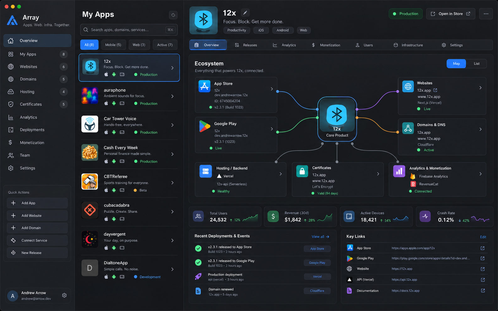
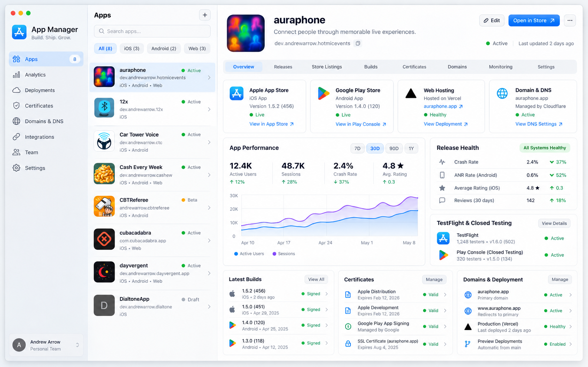
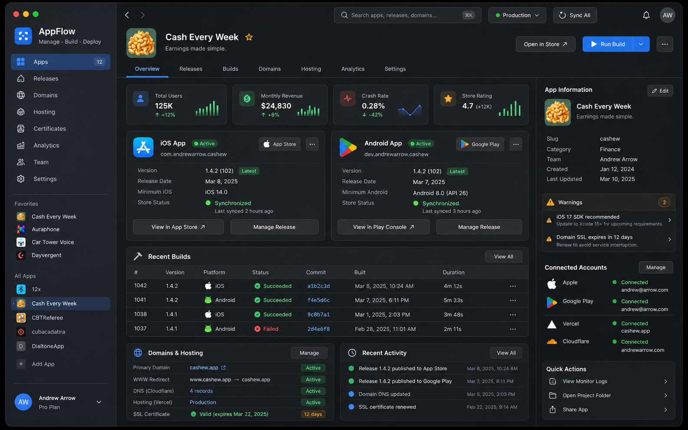
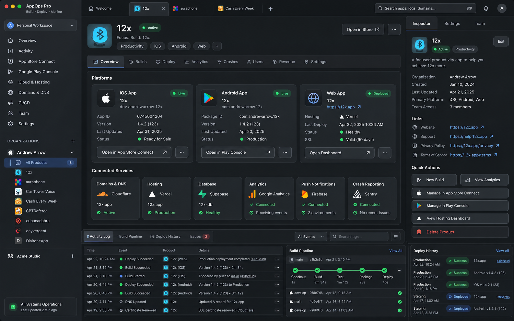

# DeployerCoaster
desktop installed based software for developers to help with app store connect, google play store, domain registration, and hosting

# Screenshots

# Details

Run the desktop studio with `cargo run --manifest-path studio/Cargo.toml`.

Open **Analytics** for daily and monthly App Store sales reports, or an app's
**Analytics** tab for its reports. In **Settings → Apple**, save your App Store
Connect Team Key credentials and vendor number (found in Payments and Financial
Reports). The key needs permission to download sales reports. Reports show units,
developer proceeds by currency, and expandable device/version, download, update,
redownload, and country breakdowns. Reports are cached locally by account, vendor,
and period; **Refresh** downloads revisions. Monthly reports default to the previous
month, and daily reports to yesterday.

The empty window has a **Connect Play Store** button. It opens Google sign-in in
your default browser, receives the authorization through a local loopback callback,
and lists the account's accessible apps by title and package name. Refresh reloads
the list; Disconnect clears the session. Access and refresh tokens stay in memory
and are discarded when the app closes.

Use a Google OAuth **Desktop app** client JSON. The studio looks for it in:

1. The path set by `DEPLOYERCOASTER_GOOGLE_CLIENT_SECRET`, if supplied.
2. `DeployerCoaster/google-oauth.json` in the OS configuration directory.
3. The supplied `client_secret_40330924720-un43h7i7gmclerblihu0qjh815tfchr6.apps.googleusercontent.com.json` in Downloads.

Enable the [Google Play Android Developer API](https://console.cloud.google.com/apis/library/androidpublisher.googleapis.com)
and [Google Play Developer Reporting API](https://console.cloud.google.com/apis/library/playdeveloperreporting.googleapis.com)
in the client's Google Cloud project. Sign-in requests `androidpublisher` and
`playdeveloperreporting`: Google's [app discovery endpoint](https://developers.google.com/play/developer/reporting/reference/rest/v1beta1/apps/search)
requires the reporting scope. The Google account must have access to the apps in
Play Console. If the OAuth app is in testing, add the signing-in account to its
test users. Keep the client JSON outside the repository.
